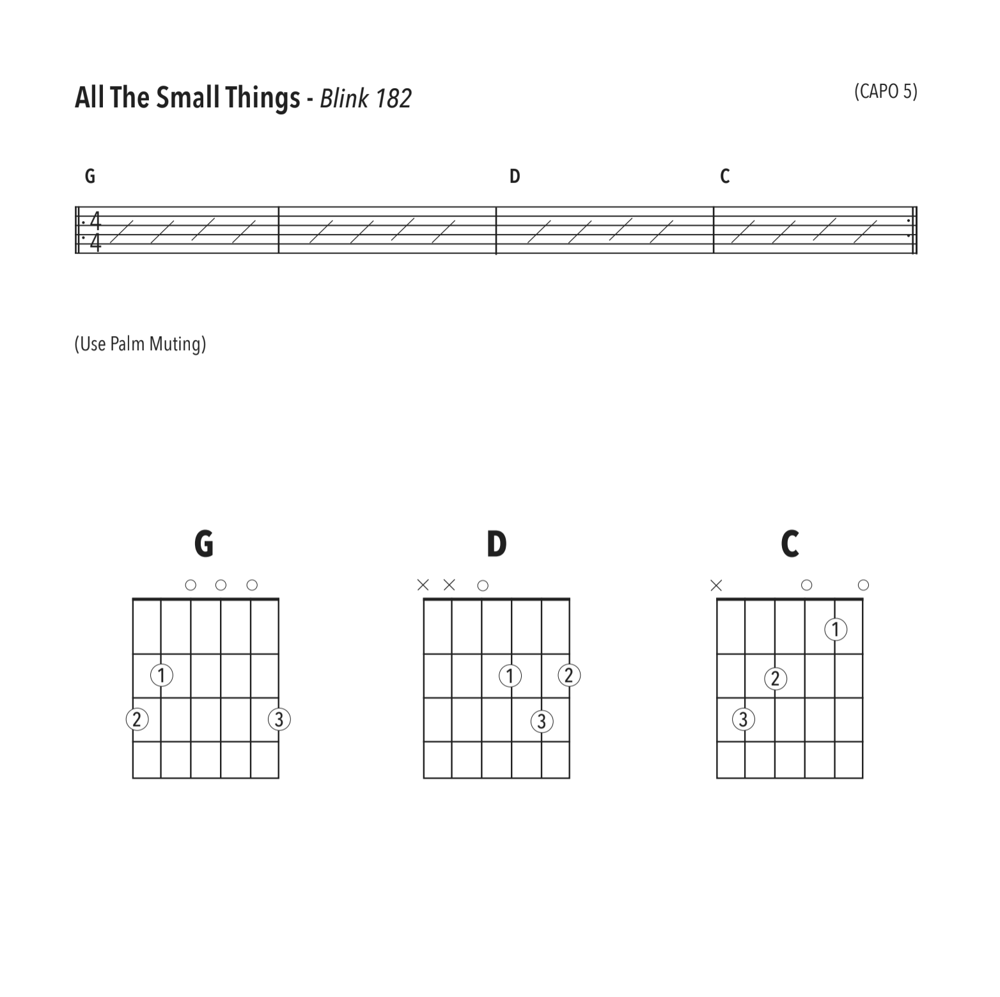

## 2020-05-08 Class 1 

### Common Chords 

### Strumming Workout 

### Stand By Me 

### Beatles - Daytrippers 

### Palm Muting 

<iframe width="560" height="315" src="https://www.youtube.com/embed/76ZOPqcjK8c" frameborder="0" allow="accelerometer; autoplay; encrypted-media; gyroscope; picture-in-picture" allowfullscreen></iframe>

### Blink 182 - All The Small Things 

<iframe width="560" height="315" src="https://www.youtube.com/embed/9Ht5RZpzPqw" frameborder="0" allow="accelerometer; autoplay; encrypted-media; gyroscope; picture-in-picture" allowfullscreen></iframe>
