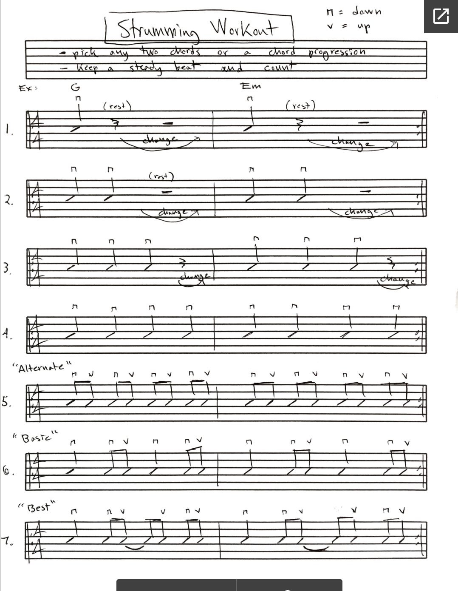
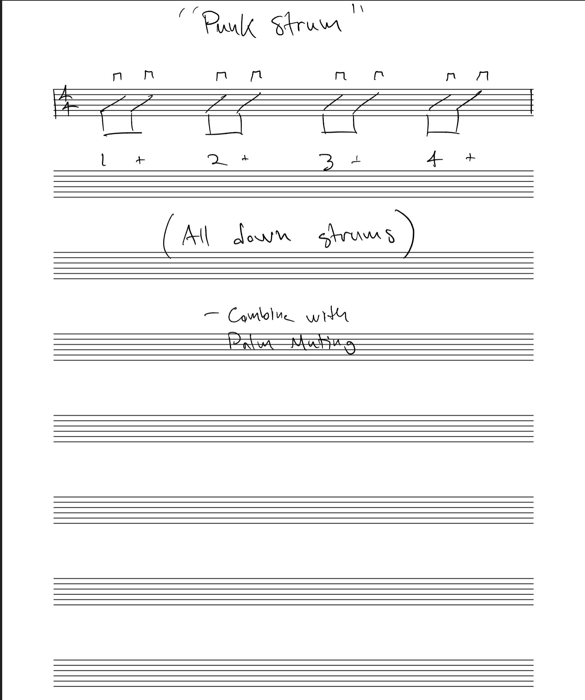
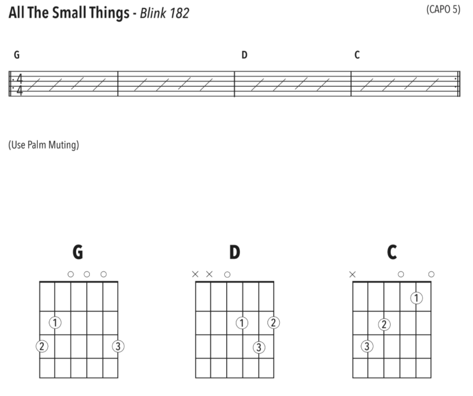
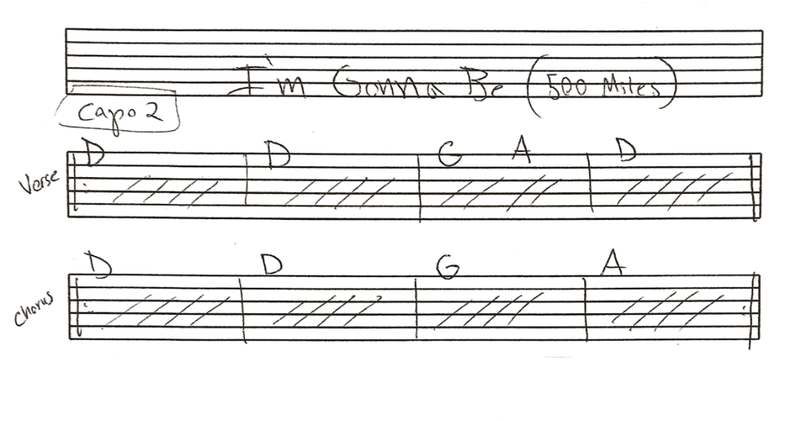

* TOC 
{:toc}

# 2020-05-08 

## Common Chords 

## Strumming Workout 

## Stand By Me 

## Beatles - Daytrippers 

## Palm Muting 

<iframe width="560" height="315" src="https://www.youtube.com/embed/76ZOPqcjK8c" frameborder="0" allow="accelerometer; autoplay; encrypted-media; gyroscope; picture-in-picture" allowfullscreen></iframe>

## Blink 182 - All The Small Things 

<iframe width="560" height="315" src="https://www.youtube.com/embed/9Ht5RZpzPqw" frameborder="0" allow="accelerometer; autoplay; encrypted-media; gyroscope; picture-in-picture" allowfullscreen></iframe>

## I'm Gonna Be (500 Miles)

# 2nd Class 2020-05-14

## 8th/16th note

## Natural Notes on any String

## 4 Non Blondes - What's Up

<iframe width="560" height="315" src="https://www.youtube.com/embed/6NXnxTNIWkc" frameborder="0" allow="accelerometer; autoplay; encrypted-media; gyroscope; picture-in-picture" allowfullscreen></iframe>

## Beatles - Let It Be

<iframe width="560" height="315" src="https://www.youtube.com/embed/QDYfEBY9NM4" frameborder="0" allow="accelerometer; autoplay; encrypted-media; gyroscope; picture-in-picture" allowfullscreen></iframe>
